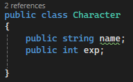
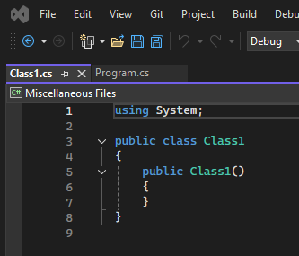

# Participation: Classes, Structs, and OOP

## Goal

To mess around with classes and get some hands on experience.

## Instructions

Now that you have completed the readings. Here is a targeted exercise to make sure we have at least some experience actually writing some code. If you have not completed the readings, then please try to go back and at least skim through them. They provide foundational knowledge.

As usual, make a new repo and start up a new project.


### Introducing OOP

Object-Oriented Programming is the main programming paradigm that you’ll use when coding in C#. If classes and structs are the blueprints of our programs, then OOP is the architecture that holds everything together. When we refer to OOP as a programming paradigm, we are saying that it has specific principles for how the overall program should work and communicate.

Essentially, OOP focuses on objects rather than pure sequential logic—the data they hold, how they drive action, and, most importantly, how they communicate with each other.

### Defining classes

Way back in the beginning of the semster, we talked about the building blocks of programming. (variables, methods, classes, and comments) Our metaphor for classes were how they re sort of like blueprints for objects.
 
A big thing to remember with classes is that they are **reference types**—that is, when they are assigned or passed to another variable, the original object is referenced, not a new copy. We’ll get into this after we discuss structs in the *Declaring structs* section. However, before any of that, we need to understand the basics of creating classes.

Classes are created using the class keyword, and they follow a template:

```
accessModifier class UniqueName
{
    Variables
    Constructors
    Methods
}
```

> **NOTE:** Any variables or methods declared inside a class belong to that class and are accessed through its unique class name.

To make the examples as cohesive as possible throughout this exercise, we’ll be creating and modifying a simple Character class that a typical game would have. We’ll also be moving away from code screenshots to get you accustomed to reading and interpreting code as you would see it “in the wild.” However, the first thing we need is a custom class of our own, so let’s create one.

The first thing we will do is write some code right above our "internal class Program" code block.

Outside our program class we will make a new class. Let's make a public Character class.


Character is now registered as a public class blueprint. This means that any class in the project can use it to create characters. However, these are just the instructions—to create a character takes an additional step. This creational step is called **instantiation** and is the subject of the next section.

### Instantiating class objects

**Instantiation** is the act of creating an object from a specific set of instructions, which is called an **instance**. If classes are blueprints, instances are the houses built from their instructions; every new instance of Character is its object, just as two houses built from the same instructions are still two different physical structures. What happens to one doesn’t have any repercussions for the other.

Previously, we created an array, which is a default class that come with C#, using it's type and the new keyword. We can do the same thing for custom classes such as Character, which you’ll do next.

We declared the Character class as public, which means you can create a Character instance in any other class. Since we have our special main method in our Program class working already, let’s declare a new character in the Main() method.


Let’s break this down one step at a time:
1. The variable type is specified as `Character`, meaning that the variable is an instance of that class.
2. The variable is named `hero`, and it is created using the `new` keyword, followed by the `Character` class name and two parentheses (). This is where the actual instance is created in the program’s memory, even if the class is empty right now.
3. We can use the `hero` variable just like any other object we’ve worked with so far. When the `Character` class gets variables and methods of its own, we can access them from hero using dot notation. Similar to how we have been using the `WriteLine` method of the `Console` class.

Now, our character class can’t do much without any class fields to work with. We’ll be adding class fields and more in the next few sections.

### Adding class fields

Adding variables, or fields, to a custom class is no different from what we’ve already been doing. The same concepts apply, including access modifiers, variable scope, and value assignments. However, any variables belonging to a class are created with the class instance, meaning that if there are no values assigned, they will default to zero or null. In general, choosing to set initial values comes down to what information they will store:
- If a variable needs to have the same starting value whenever a class instance is created, setting an initial value is a solid idea. This would be useful for something like experience points or the starting score.
- If a variable needs to be customized in every class instance, like CharacterName, leave its value unassigned and use a class constructor.

Every character class is going to need a few basic fields; it’s your job to add them.

Let’s incorporate two variables to hold the character’s name and the number of starting experience points:
1. Add two public variables inside the Character class’s curly braces—a string variable for the name, and an integer variable for the experience points.
2. Leave the name value empty, but set the experience points to 0 so that every character starts from the bottom:



3. Back in the Main method, right after the Character instance was initialized. Use it to print out the new characters's name and exp variables using dot notation:

```C#
Character hero = new Character();
Console.WriteLine("Hero: " + hero.name + " - " + hero.exp + " EXP");
```
4. When hero is initialized, name is assigned a null value that shows up as an empty space in the console window, while exp prints out as 0.


At this point, our class is working, but it’s not very practical with these empty values. We'll need to fix that with what’s called a class constructor.

### Using constructors

Class constructors are special methods that fire automatically when a class instance is created. Constructors build the class according to its blueprint:
- If a constructor is not specified, C# generates a default one. The default constructor sets any variables to their default type values—numeric values are set to 0, Booleans to false, and reference types (classes) to null.
- Custom constructors can be defined with parameters, just like any other method, and are used to set class variable values at initialization.
- A class can have multiple constructors.

Constructors are written like regular methods but with a few differences; for instance, they need to be public, have no return type, and the method name is always the class name. As an example, let’s add a basic constructor with no parameters to the Character class and set the name field
to something other than null.

Add this new code directly underneath the class variables, as follows:
```C#
    public class Character
    {
        public string name;
        public int exp = 0;

        public Character()
        {
            name = "Not assigned";
        }
    }
```

Run the project again and you’ll see the hero instance using this new constructor. The console window will show the hero’s name as `Not assigned` instead of a null value:


This is good progress, but we need the class constructor to be more flexible. This means that we need to be able to pass in values so that they can be used as starting values, which you’ll do next.

Now, the Character class is starting to behave more like a real object, but we can make this even better by adding a second constructor to take in a name at initialization and set it to the name field:

1. Add another constructor to `Character` that takes in a string parameter, called name.
Having multiple constructors in a single class is called **constructor overloading**.
2. Assign the parameter to the class’s `name` variable using the `this` keyword:

```C#
    public class Character
    {
        public string name;
        public int exp = 0;

        public Character()
        {
            name = "Not assigned";
        }

        public Character(string name)
        {
            this.name = name;
        }
    }
```

3. For convenience, constructors will often have parameters that share a name with a class variable. In these cases, use the this keyword to specify which variable belongs to the class. In the example here, this.name refers to the class’s name variable, while name is the parameter; without the this keyword, the compiler will throw a warning because it won’t be able to tell them apart. For clarity, you could also have used the this keyword in the default constructor where we set the name property to Not assigned.
4. Create a new Character instance in our Main method, called heroine. Use the custom constructor to pass in a name when it’s initialized and print out the details in the console window:

```C#
Character heroine = new Character("Agatha");
Console.WriteLine("Hero: " + heroine.name + " - " + heroine.exp + " EXP");
```

5. When a class has multiple constructors or a method has multiple variations, Visual Studio will show a set of arrows in the autocomplete popup that can be scrolled through using the arrow keys:


6. We can now choose between the basic and custom constructors when we initialize a new Character class. The Character class itself is now far more flexible when it comes to configuring different instances for different situations:


Now the real work starts; our class needs methods to be able to do useful things besides acting as a storage facility for variables. Your next task is to put this into practice.

### Declaring class methods

Adding methods to custom classes is no different from adding them to LearningCurve. However, this is a good opportunity to talk about a staple of good programming—Don’t Repeat Yourself (DRY). DRY is a benchmark of all well-written code. Essentially, if you find yourself writing the same line, or lines, over and over, it’s time to rethink and reorganize. This usually takes the form of a new method to hold the repeated code, making it easier to modify and call that functionality elsewhere in the current script or even from other scripts.

In programming terms, you’ll see this referred to as abstracting a method or feature.

We have a fair bit of repeated code already, so let’s take a look and see where we can increase the legibility and efficiency of our scripts.

Our repeated console prints are a perfect opportunity to abstract out some code directly into the Character class:

1. Add a new public method with a void return type, called PrintStatsInfo, to the
Character class.
2. Copy paste the console writeline from the main method into the new method body.
3. Change the variables to name and exp, since they can now be refereenced from the class directly:

```C#
public void PrintStatsInfo()
{
    Console.WriteLine("Hero: " + this.name + " - " + this.exp + " EXP");
}
```

4. Replace the character console write line that we previously added to our main method with method calls to PrintStatsInfo, and then run your program.

```C#
Character hero = new Character();
hero.PrintStatsInfo();

Character heroine = new Character("Agatha");
heroine.PrintStatsInfo();
```

5. Now that the Character class has a method, any instance can freely access it using dot notation. Since hero and heroine are both separate objects PrintStatsInfo prints their respective name and exp values to the console window.

This behavior is better than having the prints directly in the Main method. It’s always a good idea to group functionality into a class and drive action through methods. This makes the code more readable—as our Character objects are giving a command when printing out the "stats" logs, instead of repeating code.

The entire Character class should look like the following code:

```C#
public class Character
{
    public string name;
    public int exp = 0;

    public Character()
    {
        name = "Not assigned";
    }

    public Character(string name)
    {
        this.name = name;
    }

    public void PrintStatsInfo()
    {
        Console.WriteLine("Hero: " + this.name + " - " + this.exp + " EXP");
    }
}
```

With classes covered, you’re well on your way to writing modularized code that’s readable, lightweight, and reusable. Now it’s time to tackle the class’s cousin object —the struct!

### Declaring structs
Structs are similar to classes in that they are also blueprints for objects you want to create in your programs. The main difference is that they are value types, meaning they are passed by value instead of reference, like classes are. When structs are assigned or passed to another variable, a new copy of the struct is created, so the original isn’t referenced at all. We’ll go into this in more
detail in the next section. First, we need to understand how structs work and the specific rules that apply when creating them.

Structs are declared in the same way as classes, and can hold fields, methods, and constructors:

```
accessModifier struct UniqueName
{
    Variables
    Constructors
    Methods
}
```
Like classes, any variables and methods belong exclusively to the struct and are accessed by its unique name.

However, structs have a few limitations:
- Variables cannot be initialized with values inside the struct declaration unless they’re marked with the static or const modifier. For example, the following code would throw an error:

```C#
public struct Author
{
    string name = "Harrison";
    int age = 32;
}
```

- Constructors without parameters aren’t permitted. For example, the following code would also throw an error:

```C#
public struct Author
{
    public Author()
    {
    }
}
```

- Structs come with a default constructor that will automatically set all variables to their
default values according to their type.

Every character requires a good weapon, and these weapons are the perfect fit for a struct object over a class. We’ll discuss why that is in the Understanding reference and value types section of this chapter. However, first, you’re going to create one to play around with.

Our characters are going to need good weapons to see them through quests, which are good candidates for a simple struct. 

Inbetween our Character class and our Program class, we should make a struct!

1. Declare a public struct called Weapon, followed by a set of curly braces.
2. Add a field for name of type string and another field for damage of type int.
3. You can have classes and structs nested within each other, but this is generally frowned upon because it clutters up the code:

```C#
public struct Weapon
{
    public string name;
    public int damage;
}
```

4. Declare a constructor with the name and damage parameters, and set the struct fields using the this keyword:

```C#
public Weapon(string name, int damage)
{
    this.name = name;
    this.damage = damage;
}
```

5. Add a method below the constructor to print out the weapon information:

```C#
public void PrintWeaponStats()
{
    Console.WriteLine("Weapon: " + this.name + " - " + this.damage + " DMG");
}
```

6. Back in the Main method, create a new Weapon struct using the custom constructor and the new keyword, then use the PrintWeaponStats method to display the struct values: 

```C#
Weapon huntingBow = new Weapon("Hunting Bow", 105);
huntingBow.PrintWeaponStats();
```

7. Our new huntingBow object uses the custom constructor and provides values for both fields on initialization.

Now that we have an example of both reference (class) and value (struct) objects, it’s time to get acquainted with each of their finer points. More specifically, you’ll need to understand how each of these objects is passed and stored in memory.

### Understanding reference and value types

Other than keywords and initial field values, we haven’t seen much difference between classes and structs so far. Classes are best suited for grouping together complex actions and data that will change throughout a program; structs are a better choice for simple objects and data that will remain constant for the most part, like values that stay the same throughout the entire project. Besides their uses, they are fundamentally different in one key area—that is, how they are passed or assigned between variables. Classes are **reference types**, meaning that they are passed by reference; structs are **value types**, meaning that they are passed by value.

### Reference types

When the instances of our Character class are initialized, the `hero` and `heroin`e variables don’t hold their class information—instead, they hold a reference to where the object is located in the program’s memory. If we assigned `hero` or `heroine` to another variable in the same class, the memory reference is assigned, not the character data. This has several implications, the most important being that if we have multiple variables storing the same memory reference, a change to one affects them all.

Topics like this are better demonstrated than explained; it’s up to you to try this out in a practical example, next.

It’s time to test that the Character class is a reference type:

1. Declare a new Character variable in our Main method called `villain`. Assign `villain` to the `hero` variable and use the `PrintStatsInfo` method to print out both sets of information.

```C#
static void Main(string[] args)
{
    Console.WriteLine("Hello, World!");

    Character hero = new Character();
    hero.PrintStatsInfo();

    Character heroine = new Character("Agatha");
    heroine.PrintStatsInfo();

    Weapon huntingBow = new Weapon("Hunting Bow", 105);
    huntingBow.PrintWeaponStats();

    //Testing reference types
    Character villian = hero;

    hero.PrintStatsInfo();
    villian.PrintStatsInfo();
}
```

2. Run the program and observe the console window. The two prints will be identical because villain was assigned to hero when it was created. At this point, both hero and villain point to where hero is stored in memory.


3. Now, change the name of villain to something fun. After, print out the information again.

```C#
//Testing reference types
Character villian = hero;

hero.PrintStatsInfo();
villian.PrintStatsInfo();

villian.name = "Sir Kane the Brave";

hero.PrintStatsInfo();
villian.PrintStatsInfo();
```

4. Observe the output. You’ll see that both hero and villian now have the same name, even though only one of our characters’ data was changed:


The lesson here is that reference types need to be treated carefully and not copied when assigned to new variables. Any change to one reference trickles through all other variables holding the same reference.

If you’re trying to copy a class, either create a new, separate instance or reconsider whether a struct might be a better choice for your object blueprint. You’ll get a better glimpse of value types in the following section.

### Value types

When a struct object is created, all of its data is stored in its corresponding variable with no references or connections to its memory location. This makes structs useful for creating objects that need to be copied quickly and  efficiently, while still retaining their separate identities. Try this out with our Weapon struct in the following exercise.

Let’s create a new weapon object by copying `huntingBow` into a new variable and updating its data to see whether the changes affect both structs:

1. Declare a new `Weapon` struct in our Main method, and assign huntingBow as its initial value:

```C#
static void Main(string[] args)
{
    Console.WriteLine("Hello, World!");

    Character hero = new Character();
    hero.PrintStatsInfo();

    Character heroine = new Character("Agatha");
    heroine.PrintStatsInfo();

    Weapon huntingBow = new Weapon("Hunting Bow", 105);
    huntingBow.PrintWeaponStats();

    //Testing reference types
    Character villian = hero;

    hero.PrintStatsInfo();
    villian.PrintStatsInfo();

    villian.name = "Sir Kane the Brave";

    hero.PrintStatsInfo();
    villian.PrintStatsInfo();

    //Testing value types
    //note: hunting bow is declared above
    Weapon warBow = huntingBow;
}
```

2. Print out each weapon’s data using the print method:

```C#
huntingBow.PrintWeaponStats();
warBow.PrintWeaponStats();
```

3. The way they’re set up now, both huntingBow and warBow will have the same print logs, just like our two characters did before we changed any data:


4. Change the `warBow.name` and `warBow.damage` fields to values of your choice and print their stats again.

```C#
//Testing value types
//note: hunting bow is declared above
Weapon warBow = huntingBow;

huntingBow.PrintWeaponStats();
warBow.PrintWeaponStats();

warBow.name = "War Bow";
warBow.damage = 155;

huntingBow.PrintWeaponStats();
warBow.PrintWeaponStats();
```
5. The console will show that only the data relating to warBow was changed, and that huntingBow retains its original data.


The takeaway from this example is that structs are easily copied and modified as their separate objects, unlike classes, which retain references to an original object. Now that we understand a little more about how structs and classes work under the hood, and have confirmed how reference and value types behave in their natural habitat, we’re in a good place to start talking about one of the most important coding topics, OOP, and how it fits into the programming landscape.

### Integrating the object-oriented mindset

Things in the physical world operate on a similar level to OOP; when you want to buy a soft drink, you grab a can of soda, not the liquid itself. The can is an object, grouping related information and actions together in a self-contained package. However, there are rules when dealing with objects, both in programming and the grocery store—for instance, who can access them. Different variations and generic actions all play into the nature of the objects all around us.

In programming terms, these rules are the main tenets of OOP: **encapsulation**, **inheritance**, and **polymorphism**. Let’s discuss these topics in the next few sections!

### Encapsulation

One of the best things about OOP is that it supports encapsulation—defining how accessible an object’s variables and methods are to outside code (this is sometimes referred to as calling code). Take our soda can as an example—in a vending machine, the possible interactions are limited. Since the machine is locked, not just anyone can come up and grab one; if you happen to have the
right change, you’ll be allowed provisional access to it, but in a specified quantity. If the machine itself is locked inside a room, only someone with the door key will even know the soda can exists.

The question you’re asking yourself now is, how do we set these limitations? The simple answer is that we’ve been using encapsulation this entire time by specifying access modifiers for our object variables and methods.

Let’s try out a simple encapsulation example to understand how this works in practice. Our Character class is public, as are its fields and methods. However, what if we wanted a method that can reset a character’s data to its initial values? This could come in handy, but could prove disastrous if it was accidentally called, making it a perfect candidate for a private object member:

1. Create a private method called Reset, with no return value inside the Character class. Set the name and exp variables back to "Not assigned" and 0, respectively:

```C#
private void Reset()
{
    this.name = "Not assigned";
    this.exp = 0;
}
```

2. Try and call `Reset()` from the Main method.


If you’re wondering whether Visual Studio is broken, it’s not. Marking a method or variable as private will make it inaccessible using dot notation; it can only be called from within the class or struct it belongs to. If you manually type it in and hover over Reset(), you’ll see an error message regarding the method being protected.

To actually call this private method, we could add a Reset() command inside the class constructor or any other Character class method:

```C#
public Character()
{
    Reset();
}
```

Encapsulation does allow more complex accessibility setups with objects; however, for now, we’re going to stick with public and private members. 

As we begin to flesh out our big group project in the future, we’ll add different modifiers as needed.

Now, let’s talk about inheritance, which is going to be your best friend when creating class hierarchies in your future projects.

### Inheritance

A C# class can be created in the image of another class, sharing its member variables and methods, but able to define its unique data. In OOP, we refer to this as inheritance, and it’s a powerful way of creating related classes without having to repeat code. Take the soda example again—there are generic sodas on the market that have all the same basic properties, and then there are special
sodas. The special sodas share the same basic properties but have different branding, or packaging, that sets them apart. When you look at both side by side, it’s obvious that they’re both cans of soda—but they’re also obviously not the same.

The original class is usually called the base or parent class, while the inheriting class is called the derived or child class. Any base class members marked with the public, protected, or internal access modifiers are automatically part of the derived class—except for constructors. Class constructors always belong to their containing class, but they can be used from derived classes to keep repeated code to a minimum. Don’t worry too much about the different base class scenarios right now. Instead, let’s try out a simple game example.

Most games have more than one type of character, so let’s create a new class called Paladin that inherits from the Character class. You can add this new class right under the Character class. Make sure it’s outside the Character class’s curly brackets:

```C#
    public class Character
    {
        /* All our previous code inside of character */
    }

    public class Paladin: Character
    {

    }
```

All we need to do is add a colon `:` and the base class we want to inherit from, and C# does the rest. Now, any `Paladin` instances will have access to a `name` property and an `exp` property along with a `PrintStatsInfo` method.

This is great, but how do inherited classes handle their construction? You can find out in the following section.

### Base Constructors

When a class inherits from another class, they form a pyramid of sorts with member variables flowing down from the parent class to any of its derived children. The parent class isn’t aware of any of its children, but all children are aware of their parent. However, parent class constructors can be called directly from child constructors with a simple syntax modification:

```
public class ChildClass: ParentClass
{
    public ChildClass(): base()
    {
    }
} 
```
The base keyword stands in for the parent constructor—in this case, the default constructor. However, since base is standing in for a constructor, and a constructor is a method, a child class can pass parameters up the pyramid to its parent constructor.

Since we want all Paladin objects to have a name variable, and Character already has a constructor that handles this, we can call the base constructor directly from the Paladin class and save ourselves the trouble of rewriting a constructor:

1. Add a constructor to the Paladin class that takes in a string parameter, called name. Use a colon (:) and the base keyword to call the parent constructor, passing in name:

```C#
public class Paladin: Character
{
    public Paladin(string name): base(name)
    {

    }
}
```

2. In the Main method, create a new `Paladin` instance called `knight`. Use the base constructor to assign a value. Call `PrintStatsInfo` from `knight` and then take a look at the console:

```C#
//Experimenting with Inheritance
Paladin knight = new Paladin("Sir Arthur");
knight.PrintStatsInfo();
```
3. The console print will be the same as our other Character instances, but with the name that we assigned to the Paladin constructor:


When the `Paladin` constructor fires, it passes the name parameter to the `Character` constructor, which sets the name value. Essentially, we used the `Character` constructor to do the initialization work for the `Paladin` class, making the `Paladin` constructor only responsible for initializing its unique properties, which it doesn’t have at this point.

Aside from inheritance, there will be times when you want to make new objects out of a combination of other existing objects. Think of LEGO®; you don’t start building from nothing—you already have different colored blocks and structures to work with. In programming terms, this is called **composition**, which we’ll discuss in the following section.

### Composition

Aside from inheritance, classes can be composed of other classes. Take our `Weapon` struct, for example. `Paladin` can easily contain a `Weapon` variable inside itself and have access to all its properties and methods. Let’s do that by updating `Paladin` to take in a starting weapon and assign its value in the constructor:

```C#
public class Paladin: Character
{
    public Weapon weapon;

    public Paladin(string name, Weapon weapon): base(name)
    {
        this.weapon = weapon;
    }
}
```

Since `weapon` is unique to `Paladin` and not `Character`, we need to set its initial value in the constructor. We also need to update the `knight` instance to include a `Weapon` variable. So, let’s go back to our Main method and use `huntingBow`:

```C#
Paladin knight = new Paladin("Sir Arthur", huntingBow);
```

If you run the game now, you won’t see anything different because we’re using the `PrintStatsInfo` method from the `Character` class, which doesn’t know about the `Paladin` class’s `weapon` property.

To tackle this problem, we need to talk about **polymorphism**.

### Polymorphism

**Polymorphism** is the Greek word for *many-shaped* and applies to OOP in two distinct ways:
- Derived class objects are treated the same as parent class objects. For example, an array of `Character` objects could also store `Paladin` objects, as they derive from `Character`.
- Parent classes can mark methods as virtual, meaning that their instructions can be modified by derived classes using the override keyword. In the case of `Character` and `Paladin`, it would be useful if we could debug different messages from `PrintStatsInfo` for each one.

Polymorphism allows derived classes to keep the structure of their parent class while also having the freedom to tailor actions to fit their specific needs. Any method you mark as virtual will give you the freedom of object polymorphism. Let’s take this new knowledge and apply it to our character print stats method.

Let’s modify `Character` and `Paladin` to print out different print logs using `PrintStatsInfo`:

1. Change `PrintStatsInfo` in the `Character` class by adding the `virtual` keyword between `public` and `void`:

```C#
public virtual void PrintStatsInfo()
{
    Console.WriteLine("Hero: " + this.name + " - " + this.exp + " EXP");
}
```

2. Declare the `PrintStatsInfo` method in the `Paladin` class using the `override` keyword. Add a Console.WriteLine() call to print out the Paladin properties in whatever way you like:

```C#
public override void PrintStatsInfo()
{
    Console.WriteLine("Hail " + this.name + " - take up your " + this.weapon.name + "!");
}
```

3. This might look like repeated code, which we already said is bad form, but this is a special case. What we’ve done by marking `PrintStatsInfo` as virtual in the `Character` class is to tell the compiler that this method can have many shapes according to the calling class.

4. When we declared the overridden version of `PrintStatsInfo` in `Paladin`, we added the custom behavior that only applies to that class. Thanks to polymorphism, we don’t have to choose which version of `PrintStatsInfo` we want to call from a `Character` or `Paladin` object—the compiler already knows:


### Summary

This was a lot to take in, I know. So, let’s review some of the main points of OOP as we approach the finish line:
- OOP is all about grouping related data and actions into objects—objects that can communicate and act independently of each other
- Access to class members can be set using access modifiers, just like variables
- Classes can inherit from other classes, creating trickle-down hierarchies of parent/child relationships
- Classes can have members of other class or struct types
- Classes can override any parent methods marked as `virtual`, allowing them to perform custom actions while retaining the same blueprint

> ***SIDE NOTE:** It’s generally considered best practice to create a new .cs file for different classes instead of adding them to existing ones. This separates your code logically and avoids having too many lines of code in any single file (called a bloated file).*

> ***SIDE NOTE:** It’s a good idea to limit classes and structs to a single .cs file, but it’s fairly common to see structs that are used exclusively by a class included in the file.*

So let's do one quick and final practice with that before we finally call it a day. 

### Keeping large projects organized

There are a few ways to do this. I'll highlight two of them.

First, let's create a new file. Go to the top left of Visual Studio and click on "File" -> "New" -> "File..." to make a new file. 


Locate "C# Class" and select it.


You should now have a new C# class.



But it is not saved or in our project yet. Let's do that now. 

I'll change the name to `Adventurer` and I'll basically follow the same template as my `Character`. 


After changing the name, I'll hit "Save As..." Naviagate to your project's location. Go down into the sub folder with all your .cs files (You'll probably only see "Program.cs"). Don't forget to change the filename to your new class name. Again, I named mine "Adventurer".


Looking good!


Ok. I'll just quickly copy the code around.


You might also notice that "Adventurer.cs" has popped up in the solution explorer.


I'm going to go back into my Main method. I'll create a new "adventurer" named mike. 

```C#
//Testing external files
Adventurer mike = new Adventurer("Mike");
mike.PrintStatsInfo();
```

I'll run the program to test.


Looks good to me! 

Ok let's also add in a file another common way. Navigate over to your "solution explorer". Right click on the empty space, then go to "Add" then "New Item..." 


Click it! A new window will pop up. 


I'll make yet another class that follows the "Character" template, but this time I'll name it "Dude".


I think you'll find this way nicer. It auto places it in the solution and adds it to the proper namespace as well.


We can even check Windows Explorer. Sure enough the file is there at the proper location! Awesome!


Ok, let's follow our template and test it out!


Don't forget to create a dude in our Main method!

```C#
//Testing external files
Adventurer mike = new Adventurer("Mike");
mike.PrintStatsInfo();

Dude dave = new Dude("Dave");
dave.PrintStatsInfo();
```

Run the program! 


Wow. I sure am happy that worked!

## Reference

If you want reference to the full Main method code, then you can find it here:

```C#
static void Main(string[] args)
{
    Console.WriteLine("Hello, World!");

    Character hero = new Character();
    hero.PrintStatsInfo();

    Character heroine = new Character("Agatha");
    heroine.PrintStatsInfo();

    Weapon huntingBow = new Weapon("Hunting Bow", 105);
    huntingBow.PrintWeaponStats();

    //Testing reference types
    Character villian = hero;

    hero.PrintStatsInfo();
    villian.PrintStatsInfo();

    villian.name = "Sir Kane the Brave";

    hero.PrintStatsInfo();
    villian.PrintStatsInfo();

    //Testing value types
    //note: hunting bow is declared above
    Weapon warBow = huntingBow;

    huntingBow.PrintWeaponStats();
    warBow.PrintWeaponStats();

    warBow.name = "War Bow";
    warBow.damage = 155;

    huntingBow.PrintWeaponStats();
    warBow.PrintWeaponStats();

    //hero.Reset();

    //Experimenting with Inheritance
    Paladin knight = new Paladin("Sir Arthur", huntingBow);
    knight.PrintStatsInfo();

    //Testing external files
    Adventurer mike = new Adventurer("Mike");
    mike.PrintStatsInfo();

    Dude dave = new Dude("Dave");
    dave.PrintStatsInfo();

}
```

## Conclusion

At this point we have successfully tinkered around with some of the topics we have talked about in our readings.

We now have some hands on experience with:

- classes
- structs
- oop

## Submitting

Don't forget to submit to the mycourses dropbox. See the assignment for submission guidelines.