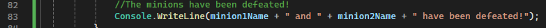

# Participation: Exploring Variables

## Goal

To mess around with variables and get more comfortable with the basics.

## Instructions

Ok. First off, make a new repo for this exercise. After all, we want to keep good practice and make sure our work is preserved in version history. Once that is set up, we should go ahead and make a visual studio project and save it inside that repo folder. It will be another simple console exercise. So just make a new console project. But remember, from now on we are going to use the more modern .NET 8.0 framework. So, select the regular "Console App" as highlighted below.


You can name it and save it however you like. I don't think that part is critical for this practice exercise. 

But don't forget to check the "Do not use top-level statements" box. For now, we still want to see our main code blocks of our program. 


Side note: I want to remind everyone that our class "program" and our "main" method behave special. For now, we are going to be creating everything inside main. We won't need access modifiers. We can just pretend that everything is private. 

Let's do what we came here to do, make some variables! In order to stay somewhat neat about it, let's add a comment that says "Variables" as well.

Just to kinda get an idea of where we are at, this is what my screen looks like at the moment.

```C#
namespace ConsoleApp2
{
    internal class Program
    {
        static void Main(string[] args)
        {
            //Variables

        }
    }
}
```

Ok. Let's ***declare*** some variables. Remember to use **camel case** like the book suggests. Let's declare 3 new string variables, one called: `heroFirstName`, one called `heroLastName`, and one called `heroFullName`.

Let's also initialize `heroFirstName` and set it equal to your first name. Initialize `heroLastName` and set it equal to your last name. Mine would be "Nick" and "Buonarota" respectivly.

After that, I'll leave a comment and get ready to actually write my instructions.

Your code might look something like this now:


Awesome. Let's move down to line 13 so we can write some instructions for our program.

Let's use the variables we made earlier to form our hero's full name. Concatenate the strings `heroFirstName` and `heroLastName` together and store the value in `heroFullName`. 

> **Thought Bubble:** Does the order of the concatenation matter? Does `heroFirstName` + `heroLastName` produce the same or a different result of `heroLastName` + `heroFirstName`?

Let's print some stuff out to the console to prove to the world that we know what we are doing.

Let's add 2 new console prints. One that prints out "Behold the glorious hero!" and then another that prints out the value stored in `heroFullName`. Do you think you can get your console to look like the below screenshot? If not then raise your hand and ask instructor Nick to come over. 


What if we wanted to put all of that into one Console print? Well, we can also use string concatenation here too! In fact, this will be super valuable when we want to debug our programs later and add "labels" when we print out data values to the console.

Let's change up our console print. Delete the last 2 lines, and make a new console log that announces our hero in style. Do you think you can get your console to look like the below screenshot? 


If not, then use this screenshot for a hint:


Let's make 2 more string variables. Go back up to where we declared all our previous variables and make 2 new string variables called `villianTitle` and `minionTitle`.

Let's make 3 more string variables, but this time let's make them private so that they don't show up in the inspector. Let's declare these variables as `villianName`, `minion1Name`, and `minion2Name`.

Our code should look something like this:


Let's set some values. Set `villianTitle` to something you think is worthy and `minionTitle` to something you think is fun. I'll set mine to "Lord of Darkness" and "Background Grunt" respectively.


Go back to the instructions part of your code, after your print, initialize the new bad guys with some names. You can name them whatever you want. These are the names I went with:


Let's have a little fun and start making a mini story! You can check out my prints and my console below for inspiration. 


I think we are good on strings for now. Let's mess with another common data type. Let's pick the integer so we can have some fun with numbers!

Go back up to where we have been declaring all our variables. Let's declare the following integers:

- heroHealth
- heroStrength
- bossHealth
- bossStrength
- minion1Health
- minion2Health
- minionStrength

Actually, while we are here we might as well initalise these variables as well. Go ahead and give them the following starting values:

- heroHealth = 100
- heroStrength = 50
- bossHealth = 100
- bossStrength = 25
- minion1Health = 50
- minion2Health = 50
- minionStrength = 5


Let's continue our story in the console and display all the character's health before the big fight! Here is an example of what I did:


Now let's do some math on our numbers! Let's simulate a fight!

Here is my code. Read the comments to get an idea of what is going on. If you are still confused, then raise your hand and ask instructor Nick to explain.


Because 50 - 50 is 0. The minions have been defeated. Nice! Let's print that to the console.



At the end of the round of combat, let's print out our hero's health, have them eat a piece of food that restores 1 health, then re-print the health to see if the number updated.

Let's use the special **increment operator** for this operation.


Let's check out the console to see if the numbers changed the way we expected them to change.


Sweet! `heroHealth` was incremented by 1. Exactly what we expected to happen with the **increment operator** of `++`

Ok, let's finish this fight. 

The code is similar to before, so you can probably write it up yourself, but in case you want, you can reference mine here:


Results of the console prints:


I think it would be nice to wrap up our story. Let's write two more lines to the console. 


Awesome work! 

## Reference

If you want reference to the full script, then you can find it here:

```C#
namespace ConsoleApp2
{
    internal class Program
    {
        static void Main(string[] args)
        {
            //Variables
            string heroFirstName = "Nick";
            string heroLastName = "Buonarota";
            string heroFullName;
            string villianTitle = "Lord of Darkness";
            string minionTitle = "Background Grunt";
            string villianName;
            string minion1Name;
            string minion2Name;

            int heroHealth = 100;
            int heroStrength = 50;
            int bossHealth = 100;
            int bossStrength = 25;
            int minion1Health = 50;
            int minion2Health = 50;
            int minionStrength = 5;

            //Begin Code Instructions
            heroFullName = heroFirstName + " " + heroLastName;

            Console.WriteLine("Behold the legendary hero of programming, whose name is: " + heroFullName);

            villianName = "Steve";
            minion1Name = "Joe";
            minion2Name = "Shmoe";

            Console.WriteLine(heroFullName + "'s arch rivial is " + villianName + " the " + villianTitle);

            //Don't forget about the minions!
            Console.WriteLine(villianName + " the " + villianTitle + " is helped out by: " + minionTitle + " " + minion1Name + " and " + minionTitle + " " + minion2Name);

            //Are you prepared to fight!?
            Console.WriteLine("The fighters enter the room!");
            Console.WriteLine("Hero's health: " + heroHealth);
            Console.WriteLine("Boss's health: " + bossHealth);
            Console.WriteLine("Minion 1's health: " + minion1Health);
            Console.WriteLine("Minion 2's health: " + minion2Health);

            //Time to fight!

            //Baddies attack our hero! Oh no!
            //Boss attacks first
            Console.WriteLine(villianName + " the " + villianTitle + " attacks " + heroFullName);
            Console.WriteLine(villianName + " the " + villianTitle + " deals " + bossStrength + " damage!");
            //Take the current health, subtract the damage then store the new value back into health
            heroHealth = heroHealth - bossStrength;
            Console.WriteLine(heroFullName + " now has " + heroHealth + " health!");
            //Minions attack
            Console.WriteLine("The evil minions attack!");
            Console.WriteLine(minion1Name + " deals " + minionStrength + " damage!");
            //Take the current health, subtract the damage then store the new value back into health
            heroHealth = heroHealth - minionStrength;
            Console.WriteLine(heroFullName + " now has " + heroHealth + " health!");
            Console.WriteLine(minion2Name + " deals " + minionStrength + " damage!");
            //Take the current health, subtract the damage then store the new value back into health
            heroHealth = heroHealth - minionStrength;
            Console.WriteLine(heroFullName + " now has " + heroHealth + " health!");

            //Hero turn to attack!
            Console.WriteLine(heroFullName + " attacks each villian for " + heroStrength + " damage!");
            //do math
            // Take the current health, subtract the damage then store the new value back into health
            // but this time lets use the combination assignment and arithmetic operator
            bossHealth -= heroStrength;
            minion1Health -= heroStrength;
            minion2Health -= heroStrength;

            //Display results in the console
            Console.WriteLine(villianName + " the " + villianTitle + " now has " + bossHealth + " health!");
            Console.WriteLine(minionTitle + " " + minion1Name + " now has " + minion1Health + " health!");
            Console.WriteLine(minionTitle + " " + minion2Name + " now has " + minion2Health + " health!");

            //The minions have been defeated!
            Console.WriteLine(minion1Name + " and " + minion2Name + " have been defeated!");

            //End of round buff!
            Console.WriteLine(heroFullName + " has " + heroHealth + " health");
            Console.WriteLine(heroFullName + " eats an apple to restore health!");
            heroHealth++;
            Console.WriteLine(heroFullName + " now has " + heroHealth + " health!");

            //final round of fight
            Console.WriteLine("The remaining fighters continue the fight!");
            Console.WriteLine("Hero's health: " + heroHealth);
            Console.WriteLine("Boss's health: " + bossHealth);
            //Boss attacks first
            Console.WriteLine(villianName + " the " + villianTitle + " attacks " + heroFullName);
            Console.WriteLine(villianName + " the " + villianTitle + " deals " + bossStrength + " damage!");
            //Take the cuurent health, subtract the damage then store the new value back into health
            heroHealth = heroHealth - bossStrength;
            Console.WriteLine(heroFullName + " now has " + heroHealth + " health!");
            //Hero turn to attack!
            Console.WriteLine(heroFullName + " attacks " + villianName + " the " + villianTitle + " for " + heroStrength + " damage!");
            //do math
            bossHealth = bossHealth - heroStrength;
            //Display results in the console
            Console.WriteLine(villianName + " the " + villianTitle + " now has " + bossHealth + " health!");

            //Results
            Console.WriteLine(heroFullName + " is victorious!");
            Console.WriteLine("Wealth, glory, and straight A+'s to the winner!");
        }
    }
}
```

## Conclusion

At this point we have successfully tinkered around with some of the topics we have talked about in class.

We now have some hands on experience with:

- working with various datatypes
- working with variables
- declaring and initalizing variables
- printing to the console
- concatenating strings
- concatenating strings in a console print to make more advanced console logs
- used the increment operator for the first time
- making a goofy console adventure story via programming

## Submitting

Don't forget to submit to the mycourses dropbox. See the assignment for submission guidelines.