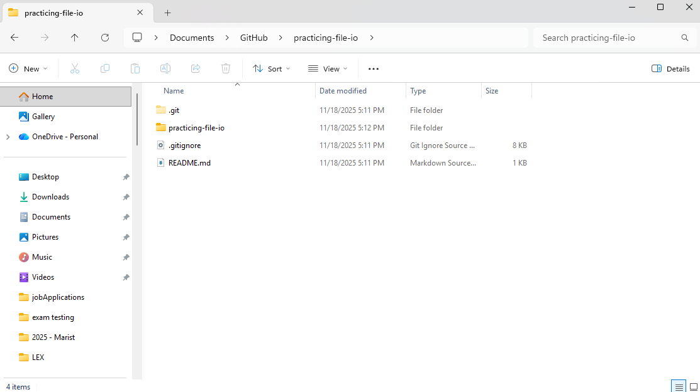
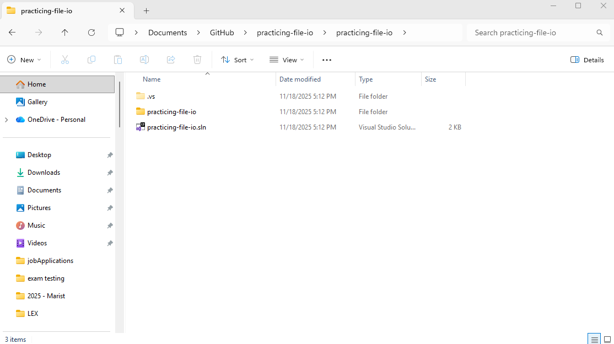
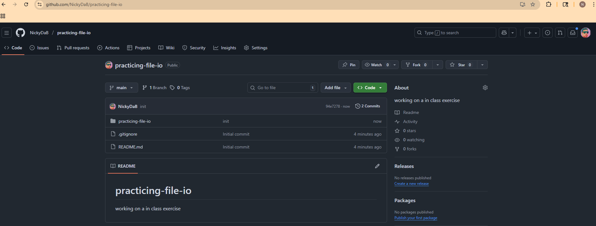
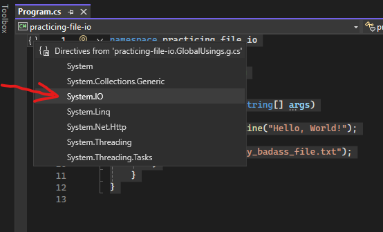
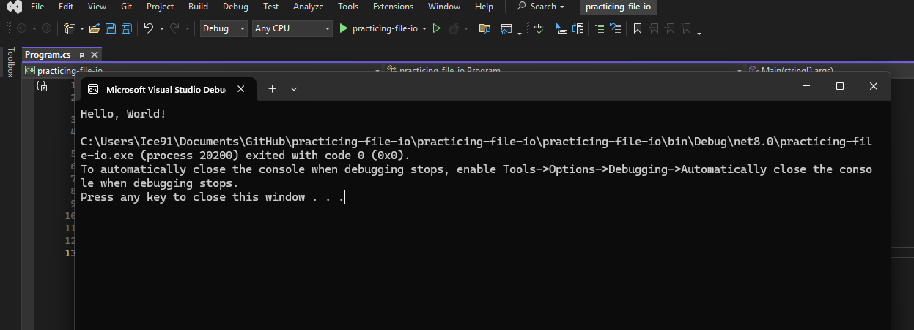
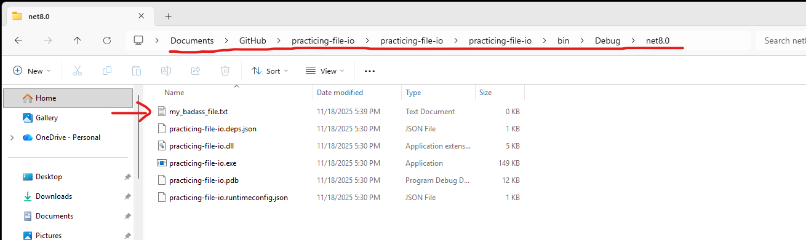
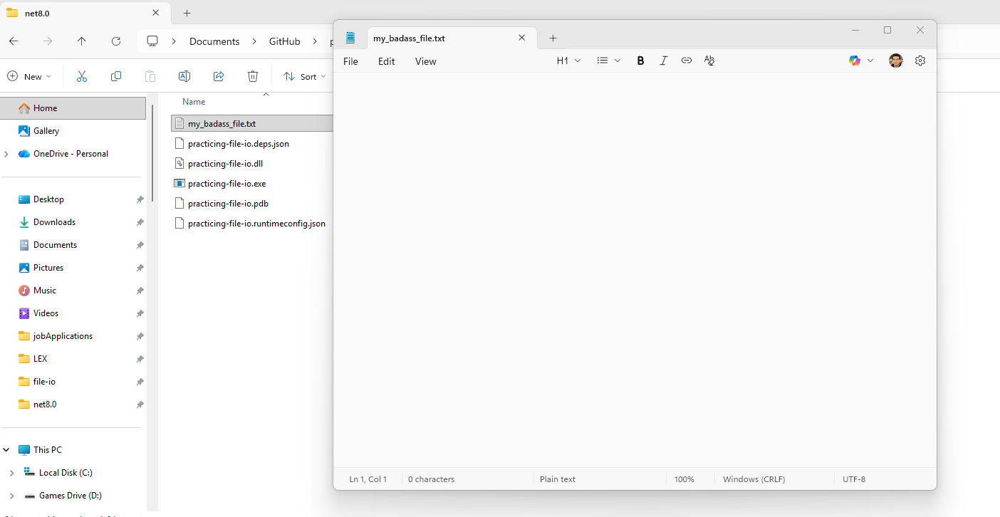
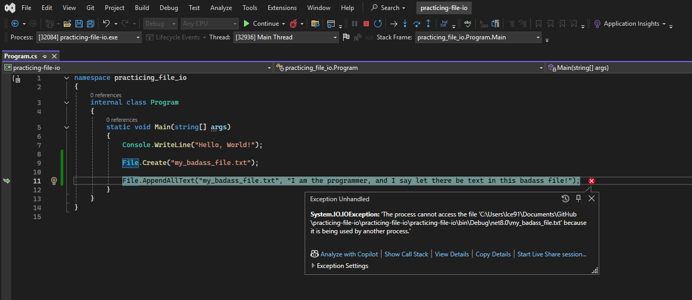
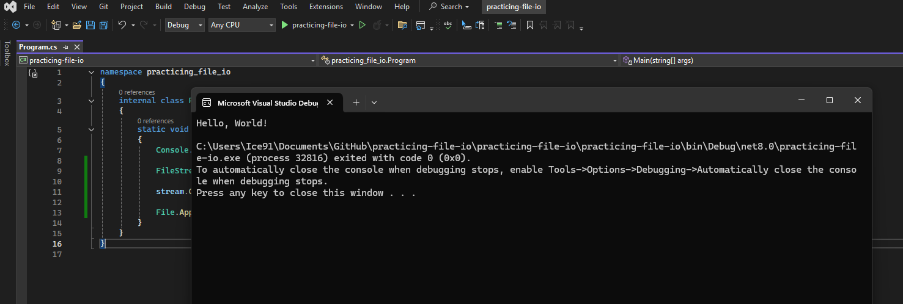

# Participation: File IO

## Goal  
Get some first hand experience with file IO:
- Navigating directories.
- Checking if files and folders exist.
- Creating and deleting files and folders.
- Writing to a file
- Reading from a file

## Objective
Follow a guided tutorial to gain some experience. This will help prepare us for more open ended assignments and challenges in the future. By gaining a little experience here and there in small bursts, we hope that future assignments won't be as scary and new! :)

## Task:  
Follow this step by step guide.

## Instructions
Let's start off by creating a new repo, a new console app, and getting everything set up as we usually do.

I'll name my project `practicing-file-io`.





Awesome, looking good and off to a solid start. :)

Let's start messing around and finding out! :O

### File Class

Here are some things we can do with the static [File](https://learn.microsoft.com/en-us/dotnet/api/system.io.file?view=net-9.0) class.

1. Find out if the file exists.
  - **For Example:** *You can check to see if a file exists using the [File.Exists](https://learn.microsoft.com/en-us/dotnet/api/system.io.file.exists?view=net-9.0) method. It’ll return true if it does, and false if it doesn’t.*
2. Read from and write to the file.
- **For Example:** *The [File.OpenRead](https://learn.microsoft.com/en-us/dotnet/api/system.io.file.openread?view=net-9.0) method lets you open a file to read data from. [File.Create](https://learn.microsoft.com/en-us/dotnet/api/system.io.file.create?view=net-9.0) creates a new file and writes to it, and [File.OpenWrite](https://learn.microsoft.com/en-us/dotnet/api/system.io.file.openwrite?view=net-9.0) opens an existing file for writing.*
3. Append text to the file.
- **For Example:** *The [File.AppendAllText](https://learn.microsoft.com/en-us/dotnet/api/system.io.file.appendalltext?view=net-9.0) method lets you append text to an already created file. It even creates the file if it’s not there when the method runs.*
4. Get information about the file.
- **For Example:** *The [File.GetLastAccessTime](https://learn.microsoft.com/en-us/dotnet/api/system.io.file.getlastaccesstime?view=net-9.0) and [File.GetLastWriteTime](https://learn.microsoft.com/en-us/dotnet/api/system.io.file.getlastwritetime?view=net-9.0) methods return the date and time when the file was last accessed and modified.*

Let's try something out! Let's make a file! 

Go to the main method of our program and type out:

```C#
File.Create("my_badass_file.txt");
```

At the moment, my program looks like this:

```C#
namespace practicing_file_io
{
    internal class Program
    {
        static void Main(string[] args)
        {
            Console.WriteLine("Hello, World!");

            File.Create("my_badass_file.txt");
        }
    }
}
```

> **Side Note:** *Let's not forget that the `File` class is one of those built in C# classes from one of the built in libraries. It is included in the `System.IO` library. We wouldn't be able to use the `File` class if we didn't include this library. Luckily, it is included by default on most projects. But don't forget to include it if you want to use file IO in your application.*



Let's try running our program. Go and hit the `play` button or press `F5`.



Uhh, ok. But did it make `my_badass_file.txt`?

How can we even check?

Well, I know where it was made, so I'll save you the trouble. But let's go find it.

Open up your windows explorer and follow down this path in your project folder.

Go into the `bin`, then `Debug`, then `net8.0`, you should see the file there.



> **Side Note:** *If you recall, this is also where the `.exe` of our project gets made when we compile our program in debug mode.

This location makes sense. This is because this location is where our executable program is running. We just said "make the file". So our program made the file and put it right in the same directory.

It's probably not good practice to just plop files out by default. We should try to stay organized. In the future, we should try to make some folders and create a tidy directory structure plan to help keep our programs and files organized. Don't worry, we will practice that later too. 

Ok. Let us try something else. Let us just simply append some text to the end of whatever is in that file. (Which is currently nothing because it is empty.) So, we will essentially be just adding in some text in that file.



Let us add in another line of code to our main method.

```C#
File.AppendAllText("my_badass_file.txt", "I am the programmer, and I say let there be text in this badass file!");
```

At the moment, my program looks like this:

```C#
namespace practicing_file_io
{
    internal class Program
    {
        static void Main(string[] args)
        {
            Console.WriteLine("Hello, World!");

            File.Create("my_badass_file.txt");

            File.AppendAllText("my_badass_file.txt", "I am the programmer, and I say let there be text in this badass file!");
        }
    }
}
```

Cool. Let's try running it again. I can't wait to see the text appear in the file!



What? Oh no! An error!? :(

That's actually ok. It was supposed to happen. And if you read the error text, you might understand why (especially if you have read the book). 

What happened was when we "created" the file earlier we used `File.Create()`. If you read the documentation, that method actually creates a [FileStream](https://learn.microsoft.com/en-us/dotnet/api/system.io.filestream?view=net-10.0) object. 

> **Side Note:** *We will mess around with FileStream objects later because its a nicer way to deal with file IO, but for now we are just messing around and trying out some stuff.*

So, right now, basically what is going on is that we opened a filestream and we made a new file. That's great. But when we went to add text to that file, we got an error that said "file is in use". That is because when we made the file, the "create" is still kinda "holding on to" the file. Our FileStream object sort of said, "I made this. It's mine. No one else can touch it." 

This is probably a good thing. Because imagine a world where everyone was trying to read, write, and edit a single file all at the same time. That could be bonkers. Think of all the crazy things that could happen. OMG the data corruption and hacks!

So, we basically need to "play nice" and take turns when reading and writing files. Only one object can mess with a file at one time.

So, how can we tell our program and our FileStream object that "playtime" is over and now its time to pass the toy along and share?

Well, thankfully, the [File.Create()](https://learn.microsoft.com/en-us/dotnet/api/system.io.file.create?view=net-10.0) method (if we look at the documentation) actually returns a value, which is the FileStream object it created.

Let's update our code so we have a reference to that `FileStream` object.

```C#
FileStream stream = File.Create("my_badass_file.txt");
```

Now that we have a reference to the object. We can call one of its built in methods to tell it to let go of the file. This would be "Close()".

```C#
stream.Close();
```

Basically, when we do this, we close the stream, thus release "my_badass_file.txt" back to the ether. Anything can access it now.

BTW, my code currently looks like this.

```C#
namespace practicing_file_io
{
    internal class Program
    {
        static void Main(string[] args)
        {
            Console.WriteLine("Hello, World!");

            FileStream stream = File.Create("my_badass_file.txt");

            stream.Close();

            File.AppendAllText("my_badass_file.txt", "I am the programmer, and I say let there be text in this badass file!");
        }
    }
}
```

Let's try re-running our program.



Oh thank the compiler! No errors this time. Such a glorious day. :)

But did anything actually happen? Let's open up that badass text file and see if our new text is there.

## Reference

If you want reference to the full program, then you can find it here:

## Conclusion

## Bonus Levels: Where can we go from here?

Are you taking this class on an "Advanced Difficultly"? 


## Submitting

Don't forget to submit to the mycourses dropbox. See the assignment for submission guidelines and rubric.