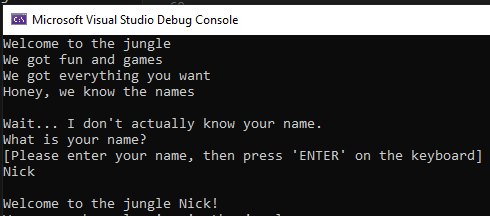
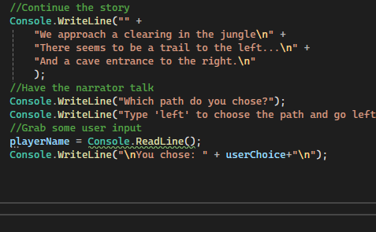
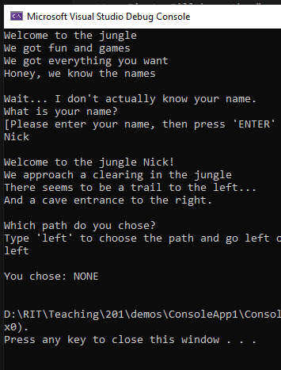
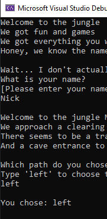

# Participation: Logic and Loops

## Goal

To mess around with logic and flow, such as if statements and while loops.

## Instructions

As usual, start off making a new repo and project for this exercise. Once you are set up and ready to go, then we can start programming!

We made a simple story last time. We will make another one, but this time we mill make it a little more interactive. We will do this to take advantage of our logical branches and maybe do something based off of user input.

Let's go and declare a new string variable at the top of our program called `playerName`. I'll also give it a default value of `adventurer`.

After that I'll print out something to the console.

We have talked about the difference between `Console.Write` and `Console.WriteLine`. I'm going to take advantage of `Console.Write` and manually put in my `new line` characters. I think you should too, just to get some experience.

Remember: `\n` is the special character for `new line`.

I'll print the following to the console: 

```
Welcome to the jungle
We got fun and games
We got everything you want
Honey, we know the names
```

So, in order to do this I'll write:

```C#
Console.Write("Welcome to the jungle\nWe got fun and games\nWe got everything you want\nHoney, we know the names\n\n");
```
I added in an extra `\n` at the end to give an extra line of space in my console.

After that, I'll throw in 3 more console prints to my story.

```C#
Console.WriteLine("Wait... I don't actually know your name.");
Console.WriteLine("What is your name?");
Console.WriteLine("[Please enter your name, then press 'ENTER' on the keyboard]");
```

At this point, my code looks something like this:

```C#
namespace ConsoleApp1
{
    internal class Program
    {

        static void Main(string[] args)
        {
            //Variables
            string playerName = "adventurer";

            //Program Start
            Console.Write("Welcome to the jungle\nWe got fun and games\nWe got everything you want\nHoney, we know the names\n\n");
            Console.WriteLine("Wait... I don't actually know your name.");
            Console.WriteLine("What is your name?");
            Console.WriteLine("[Please enter your name, then press 'ENTER' on the keyboard]");
        }
    }
}
```

We will now take advantage of another function in the Console class. `Console.ReadLine()` You can read more here: [Microsoft Documentation: Console.ReadLine Method](https://learn.microsoft.com/en-us/dotnet/api/system.console.readline?view=net-8.0) But it lets us get user input. Wow! A game changer! 

Let's use this new function to grab input from the user, specifically their name, then store that value inside of the `playerName` variable we made earlier.

If you don't remember how to do that, then use the following code:

```C#
//Grab some user input
playerName = Console.ReadLine();
Console.WriteLine("\nWelcome to the jungle " + playerName + "!");
```

Go try it out by testing our program. Mine looks like this:



Let's continue our story. 

There are multiple ways to accomplish the following. I'll let you decide how you want to do it, but I'll write mine the following way:

```C#
//Continue the story
Console.WriteLine("" +
    "We approach a clearing in the jungle\n" +
    "There seems to be a trail to the left...\n" +
    "And a cave entrance to the right.\n"
    );
```

This is a good way to test out a branching story. Let's grab some user input, then use and if statement to change what our program does based on that information.

First, I'll have the "narrator" talk a bit.

```C#
Console.WriteLine("Which path do you chose?");
Console.WriteLine("Type 'left' to choose the path and go left or type 'right' to choose the cave and go right.");
```

We don't have a way to store this info yet. We should go back up to the top of our program and declare another variable to store the user's choice.

```C#
//Variables
string playerName = "adventurer";
string userChoice = "NONE";
```

Great, now we have a way to store this new info. Let's go back to our story code and type in the following:

```C#
//Grab some user input
playerName = Console.ReadLine();
Console.WriteLine("\nYou chose: " + userChoice+"\n");
```

My code looks like this right now:



Let me hit play and test it out!



Wait... What!? I thought I typed in "left" why did it display "NONE" ? 

Well, we made a mistake earlier. We stored the user data into `playerName` not the new variable we just created `userChoice`. It was a little easier to notice when we tested because I gave my new variable a default value of something that was obviously wrong, such as "NONE" or "-1". Sometimes I suggest doing this type of standard to help you in the future. It may help you play detective later on.

Ok, let's fix our error and continue.



Sweet. Looking good!

Ok, now that we have our user's choice. Let's make an `if` statement to determine where to logically go in both our code and our adventure!

I like to stub out the code first. I'll take advantage of our newly learned "if, else if, and else" chain of logic.

```C#
//Select our path
if(userChoice == "left")
{
    //Go to the left

}else if (userChoice == "right")
{
    //Go to the right
}
else
{
    //Oh no! the user typed in something else.
}
```

I like this because we can check for our proper choices, but we also have an else case in case our user types in something that we don't expect.

I'll start coding my else statement first.

As good user experience, I want to inform my user that they did not give a valid reponse, then prompt them for another. 

This will also be a great opportunity to use a loop. (maybe we should have done that before, whoopsie.) As if the user doesn't give us valid data, we want to continue prompting them until they do.

I put the following inside my `else`

```C#
else
{
    //Oh no! the user typed in something else.
    userChoice = "NONE";
    while (userChoice != "left" && userChoice != "right" && userChoice != "up")
    {
        Console.WriteLine("Please enter either 'left', 'right', or our now super    secret answer of 'up'.");
        userChoice = Console.ReadLine();
        Console.WriteLine("\nYou chose: " + userChoice + "\n");
    }
    if (userChoice == "left")
    {
        //Go to the left
    }
    else if (userChoice == "right")
    {
        //Go to the right
    }else if(userChoice == "up")
    {
        //Easter Egg
        Console.WriteLine("'up' seriously? 'up'!? How can we go up? UP YOURS! |_(O_O)_/ **Flips keyboard** CLOSE THE PROGRAM!");
    }
    else
    {
        Console.WriteLine("I honestly don't know how you got here. Congrats.");
    }
}
```

Yeah, I added in a funny easter egg. Maybe that gets me fired at my job or maybe I get a laugh. But either way, modern games and programs don't have as many cool hidden things like in the 70's. 

Anywho. Test out the edge case, hopefully it prevents our user from not continuing the adventure.

But we still need to work on our good cases. I'm going to keep it simple, but feel free to nest some if statements and continue your story.

In the left, I'll say "congrats! you found the exit to the jungle" on the right I'll say, "Oh no. You went into the cave and there was a cave in. You are trapped!"

You should test your program at this point. Go to the left, go to the right, try bad input. Does it behave as expected?

After testing, if everything looks good, then you are done! 

## Reference

If you want reference to the full script, then you can find it here:

```C#
namespace ConsoleApp1
{
    internal class Program
    {

        static void Main(string[] args)
        {
            //Variables
            string playerName = "adventurer";
            string userChoice = "NONE";

            //Program Start
            Console.Write("Welcome to the jungle\nWe got fun and games\nWe got everything you want\nHoney, we know the names\n\n");
            Console.WriteLine("Wait... I don't actually know your name.");
            Console.WriteLine("What is your name?");
            Console.WriteLine("[Please enter your name, then press 'ENTER' on the keyboard]");
            //Grab some user input
            playerName = Console.ReadLine();
            Console.WriteLine("\nWelcome to the jungle " + playerName + "!");
            //Continue the story
            Console.WriteLine("" +
                "We approach a clearing in the jungle\n" +
                "There seems to be a trail to the left...\n" +
                "And a cave entrance to the right.\n"
                );
            //Have the narrator talk
            Console.WriteLine("Which path do you chose?");
            Console.WriteLine("Type 'left' to choose the path and go left or type 'right' to choose the cave and go right.");
            //Grab some user input
            userChoice = Console.ReadLine();
            Console.WriteLine("\nYou chose: " + userChoice+"\n");

            //Select our path
            if(userChoice == "left")
            {
                //Go to the left
                Console.WriteLine("You take the path to the left. It leads you out of the jungle. You are safe to adventure another day!");

            }else if (userChoice == "right")
            {
                //Go to the right
                Console.WriteLine("You take the path to the right. It leads you into a cave. There is a cave in and you are trapped!");
            }
            else
            {
                //Oh no! the user typed in something else.
                userChoice = "NONE";

                while (userChoice != "left" && userChoice != "right" && userChoice != "up")
                {
                    Console.WriteLine("Please enter either 'left', 'right', or our now super secret answer of 'up'.");
                    userChoice = Console.ReadLine();
                    Console.WriteLine("\nYou chose: " + userChoice + "\n");
                }

                if (userChoice == "left")
                {
                    //Go to the left
                    Console.WriteLine("You take the path to the left. It leads you out of the jungle. You are safe to adventure another day!");
                }
                else if (userChoice == "right")
                {
                    //Go to the right
                    Console.WriteLine("You take the path to the right. It leads you into a cave. There is a cave in and you are trapped!");
                }
                else if(userChoice == "up")
                {
                    //Easter Egg
                    Console.WriteLine("'up' seriously? 'up'!? How can we go up? UP YOURS! |_(O_O)_/ **Flips keyboard** CLOSE THE PROGRAM!");
                }
                else
                {
                    Console.WriteLine("I honestly don't know how you got here. Congrats.");
                }
            }
        }
    }
}
```

## Conclusion

At this point we have successfully tinkered around with some of the topics we have talked about in class.

We now have some hands on experience with:

- grabbing user input
- logic branching if statements
- into to loops

## Bonus Levels: Where can we go from here?

Are you taking this class on an "Advanced Difficultly"? Try swapping out one of the "if" statements for a switch statement. 

These challenge mode tasks won't give you more points toward your grade, but you can brag about it in Slack if you figure it out and want to show off to your peers!

## Submitting

Don't forget to submit to the mycourses dropbox. See the assignment for submission guidelines.