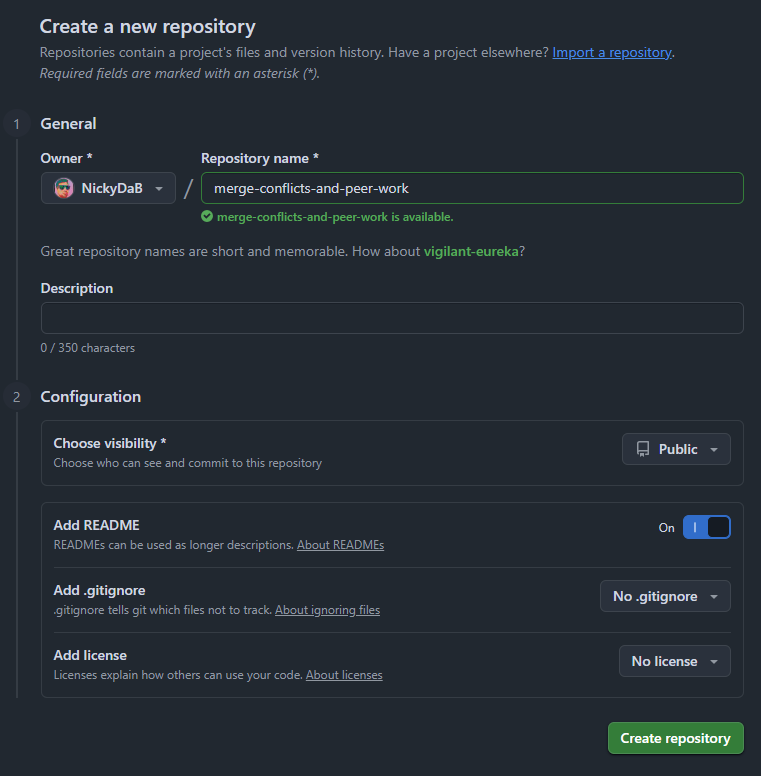

# Participation: Merge Conflicts and Peer Work

## Goal
Practice another component of version control, dealing with a merge conflict and collaborating with another teammate.

## Instructions

### Setting Up

Before we get to the important parts of the exercise that we want to practice. We need to set up our environment. 

Partner A should go to your GitHub profile and make a new repo. Name it "merge-conflicts-and-peer-work". Make it public. Add a README file. Leave gitignore and license as none.

Partner B won't be making a repo for this particular exercise.

This shouldn't be new, since we have done this in the last few exercises, but if you have issues, then raise your hand and ask Nick for help or ask your teammate for this exercise. Remember good collaboration is key!

Once the repository is created, we need Partner A to add Partner B as a collaborator. 

Go to the settings of your newly created repo.

Find "Collaborators" on the left navigation bar.

This will bring you to a new sub-page called "Collaborators and teams" and this is one way to have multiple people work on the same project and repository. 

This is probably a good name for this because a collaborator is someone who a who works jointly on an activity or project. Wow! Learning vocabulary! Look at us. :) 

Now, in order to work with our partner we will need to add them as a collaborator on this repo. Partner A should click on the "Add people" button.

Search by your partner's username and invite them to the repo.

After Partner A adds Partner B to the repo, you should see a "pending invite" status in the manage access list. 

Partner B should recieve and email or some sort of notification. Accept it and become a collaborator on this repo. When partner B does this, the pending invite status should update.

Now each partner should clone the repo down to your local machine using GitHub Desktop. When you have done this your local folder, GitHub Desktop, and github.com should look similar to these states:

local folder:

GitHub Desktop:

github.com:

### Pulling

## Conclusion

## Submitting

Don't forget to submit to the mycourses dropbox. See the assignment for submission guidelines.