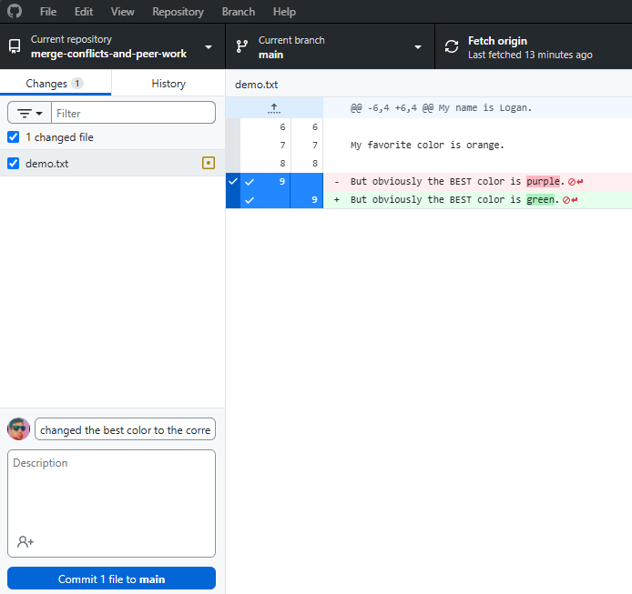

# Participation: Merge Conflicts and Peer Work

## Goal
Practice another component of version control, dealing with a merge conflict and collaborating with another teammate.

## Instructions

### Setting Up

Before we get to the important parts of the exercise that we want to practice. We need to set up our environment. 

Partner A should go to your GitHub profile and make a new repo. Name it "merge-conflicts-and-peer-work". Make it public. Add a README file. Leave gitignore and license as none.

Partner B won't be making a repo for this particular exercise.

This shouldn't be new, since we have done this in the last few exercises, but if you have issues, then raise your hand and ask Nick for help or ask your teammate for this exercise. Remember good collaboration is key!


Once the repository is created, we need Partner A to add Partner B as a collaborator. 

Go to the settings of your newly created repo.


Find "Collaborators" on the left navigation bar.


This will bring you to a new sub-page called "Collaborators and teams" and this is one way to have multiple people work on the same project and repository. 


This is probably a good name for this because a collaborator is someone who a who works jointly on an activity or project. Wow! Learning vocabulary! Look at us. :) 

Now, in order to work with our partner we will need to add them as a collaborator on this repo. Partner A should click on the "Add people" button.


Search by your partner's username and invite them to the repo.


After Partner A adds Partner B to the repo, you should see a "pending invite" status in the manage access list. 


Partner B should recieve and email or some sort of notification. Accept it and become a collaborator on this repo. When partner B does this, the pending invite status should update.


### Getting to work

Now each partner should clone the repo down to your local machine using GitHub Desktop. When you have done this your local folder, GitHub Desktop, and github.com should look similar to these states:

local folder:


GitHub Desktop:


github.com:


Now partner A should go into the local folder and create a new file called `demo.txt`.


Inside that file, Partner A should write the following lines.

```
My Name is [YOUR NAME].

My favorite color is [YOUR FAVORITE COLOR].
```

So for example, my file would look like:

```
My Name is Nick.

My favorite color is green.
```

As we can see here:


After that have Partner A save the file and commit the change to the file's version history.


After that, Partner A should also push their changes up to the repo.


At this point Partner A's repo is all up to date. But Partner B is now no longer in sync. Partner B will need to fetch from the origin and pull down the new file and updates to the repository.

Let's do that now.


And now Partner B should see the file `demo.txt` in their local repo folder.


Now, Partner B should open up the file and add in their name to line 5 and their favorite color to line 7.


After that, Partner B should save, commit, and push their changes.

Then, after that Partner A should pull down Partner B's updates.

Now with the new updated file, Partner A should add in a new statement on line 9. Saying `But obviously the BEST color is purple.`.


Then Partner A should save, commit, and push their changes. 


Partner B will now need to pull down the changes. They should now see the new line.


Partner B should now edit that line and change the BEST color to their favorite color. 

Partner B should save the file. Make a commit. (don't forget to leave nice descriptive commit messages - like Logan's example in the screenshot.)

Then push your changes up to the origin.


Now.

We want to showcase a "merge-conflict" - aka - when we work with others, try to combine all our work together, but we edited the same line, so now we need to resolve the issue.

So, Partner A should open up their `demo.txt`.

They should also edit line 9 and change the "BEST" color to their favorite color.


Partner A should save the file and make a commit.



Partner A should then try to push. But We will now see a merge conflict! Oh no!


Partner A should now follow the prompt and perform a fetch.


Now, let's resolve this merge conflict just like how we demonstrated in class.

As a reminder, the `<<<<<<<` shows where the conflict begins, the `=======` is the seperation between the two possible conflict points, and the `>>>>>>>>` is the end of the conflict.


After the conflict has been resolved. Don't forget to save the file. After you save, GitHub Desktop should recognize that you resolved the conflict.


Now click `continue merge`.

We now need to commit the merge conflict resolution to the version control history of the file. Go ahead do that, then push your changes to the origin.


At this point, Partner B can pull down the updates and your team can refresh GitHub.com

We should now see the final version of our exercise, where the conflict has been resolved, and we all now live in peace and harmony. :)


## Conclusion

At this point, your team has successfully recreated the demonstration from class. Time to celebrate this is a major skill addition. A lot of programmers (32.33% repeating of course) are too afraid of dealing with merge conflicts. 


## Submitting

Don't forget to submit to the mycourses dropbox. See the assignment for submission guidelines.