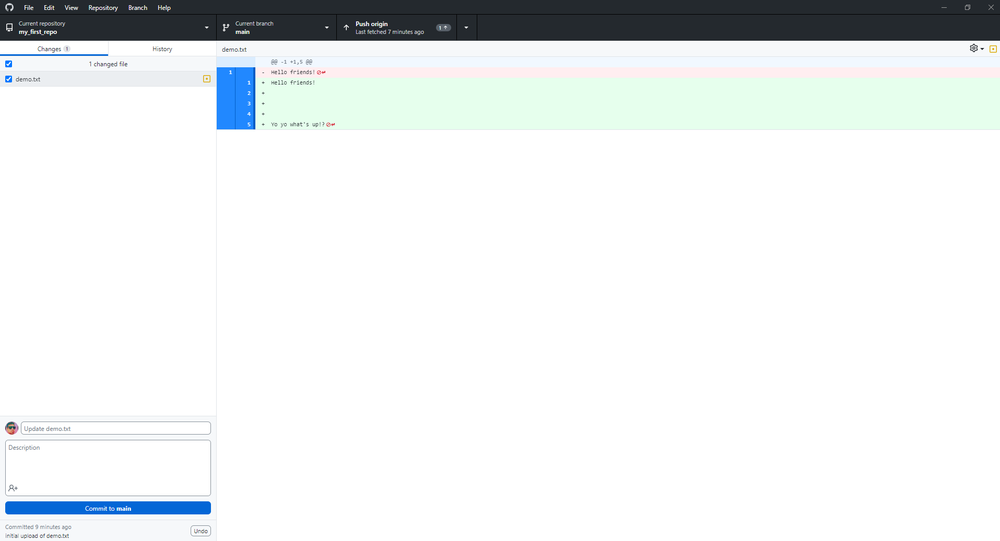

# Participation: My First GitHub Repo
## Pre Notes

### Things to know
- **Version control:** A way to keep track of a file's version history over time. 
- **Git:** A version control tool.
- **GitHub:** A community and a place to back-up/store the files. It uses git as the tool for version control.  

### Context Notes

There are many version control tools out there. Some common ones in game development are "git", "perforce", and "svn". 

We will be using git for this class. 

There are also many version control communities out there, such as "GitHub" and "Bitbucket". Some companies even host their own storage locations and may not use a community like GitHub. Other companies, might pay for special enterprise versions or private communities. 

We will be using GitHub public stuff for the purposes of learning and using version control. It should be good enough to serve our purposes.

This isn't a class on version control, tools, or communities, but hopefully, we can become familiar enough with some of the concepts to get us "working" in game development and new media projects. 

But at some point in the future, it would be very valuable to research these topics further. 

## Goal
To make our first repo, get comfortable with the basic ideas of version control, and actually get some field experience.

## Instructions

This practice exercise will be pretty short. But can still be intimidating if this is new, but don't worry. As we work with it throughout the semester, you will feel more comfortable with it! :smile:

### Setting Up

Hopefully you have already made an account for GitHub. If not, then you'll need to do this now. I suggest using a personal gmail, that way you can keep this account with you as you leave school or leave a job. You can always make another account with a school email or a work email if you need to for special benefits.

Also, the basic public personal editions should be fine. No need to buy any crazy professional enterprise editions for our class purposes.

### Work Time

Now that you have a GitHub account, you can host projects and files on the GitHub servers. This is valuable because our files are now backed-up on the cloud. This also allows us to download our work from the cloud to any computer we work on. AND THAT makes working on our home computers, library computers, or lab computers all the much easier. 

Let's go and view our profile page on GitHub. I'll be using my profile as an example, but you should be looking at your page. 

You can get to your profile by clicking on the profile icon in the upper right hand corner of the website, then when the drop down menu appears, select `Your Profile`.

This will bring you to your profile page. You'll also notice that the web address should also be your username. So, that is another way to get to your profile. Mine is: https://github.com/NickyDaB 

There is a bunch of things here. You can explore on your own. We are going to focus on the `Repositories` tab today.

**Repositories** *(or **repos** as the cool elite hackerz like to call them)* are places where you can store things. And in the context of computing, it is a central location in which data is stored and managed. For us, it is where we will store the scripts for our game projects. 

Let's go and click on the `Repositories` tab.

This will bring you to a list of what is essentially all your projects that are hosted on GitHub. Your list is probably empty. I have a few projects from over the years. 

But that will all change soon! You are about to create your first repo and host it on GitHub! Wow! Feel the excitement! Are you ready?

  

On this page, there should be a `New` button near the top left, click it! 

We see a new page, similar to this:

If you look around you should see some things here. They help you set up your repo. 

- **Owner** : Basically who owns and is the admin of your repo. For today, this will be you. In the future, it could be helpful to maybe switch this out for someone else or an organization to own the repo. 

- **Repository name** : Well, we need to call it something right? 

- **Description** : This is optional, but helpful for others who need the "Too Long Didn't Read" about your project. A one sentence description is probably good. 

- **Public / Private** : Visability of your project. For now, let's just make things public. It's easier that way, but in the future, for sensitive data or other projects, you might set this to private.

- **Initialize the repository with** : Some additional quick standard things most repos do, so GitHub added them as fast set up options. I usually always add a readme. In the future we will mess around with gitignore (which tells git to ignore some files in your project folder) and license (which says how others are allowed to use this project). We will leave them as "none" for now.

### Setting Up the Repository

Ok, now that we have the quick overview. Let's fill out the data and make the repository.

For the name I'll go with `my_first_repo`. I have some previous habits with working with various operating systems. So, for my folders and file names I like to use all lowercase letters and underscores. Feel free to do what ever you want. But understand that the name of the repo will be your "root" folder *(Aka, the folder where all your files will be located)*. Eventually, we will copy and clone this folder to our local machine, so that may impact what you call your project folder. 

> ***Side Note:** It might make sense, but you can't create multiple repositories with the same name.*  
>
> 
> 

I'll leave description blank, but you could say something like, "I'm just making this to learn about version control." When you have a real project, try to give an actual one sentence description.

Let's leave our first repo as "public".

I'm also going to check add the readme and leave the gitignore and license blank for this exercise. 

With all that done, we are ready to hit the "create" button.

You'll now automatically get brought to the repo's github page.

If you look closely, you'll notice that the web address is your account name with the repo name. So, again, another way to get here.

At this point, we made a repo, but it is essentially empty. *(well, it has that readme file in it that we auto generated.)* Now we are going to jump to our personal machine and use the program `GitHub Desktop` to `clone` *(aka, "copy" our repo from the cloud to our local computer)*. Let's get to it.

### Setting Up GitHub Desktop

If you are using a lab machine, then you can find `GitHub Desktop` pre-installed. There should be a shortcut on the desktop.

If you are using a personal machine, then you'll probably have to download it. You can find it on the github website here: [Download GitHub Desktop](https://desktop.github.com/)

There are a few ways to use `git` to manage your code, but we will use `Github Desktop` as it integrates nicely with the rest of the tools we are using. 

Once the program is installed, you can go and open it up!

### Using GitHub Desktop

Now, you will have to sign in with your account.

It should open an internet browser, but once you fill out the appropriate information you should be on your way.

Once you are all logged in you will probably see a page similar to this: 

 
> ***Side Note:*** *Extra Learning and Practice*
>
> There seems to be an official GitHub tutorial here. It might be a good idea to tinker around with that over the weekend if you have some free time and want to get the extra practice. But I'll leave that up to you.
>
> 

We will continue on with our custom tutorial for class purposes.

Since this is the first time we are cloning a repo, we will do it this way. There are a few ways to go about this, and we will try a few over the next few exercises so you can get a bit of experience with a few of the ways. 

Go to the top left of `GitHub Desktop` and click on `File`. Find the `Clone Repository...` option and then click that. 

It should open a new dialogue box. 

By default, the GitHub.com tab should be selected. If not then, go and click on that tab. This is important because we hosted our repo on github.com if we hosted it somewhere else, then we would need to select a different option.

You should then see your repo because you probably only have one, but if you have a few, then you can either scroll down, or use the filter tool.

The next thing we need to note is the `Local Path` section. This is where GitHub desktop will clone *(aka - copy)* your repo to on your local machine. 

I think for me, for this first project, putting git on my desktop with the folder name "my_first_repo" is fine. In the future, we might mess around with putting stuff in different locations. But just remember where you are cloning your files to, this will be important!

Once you are ready, hit the `clone` button. 

You might see something like this now:

Let's also check the location where we said to **clone** the repo. Remember, I put mine on the Desktop and made the folder "my_first_repo". 

Awesome, looks like my stuff was copied correctly.

If I open the file up we see everything we saw on GitHub.com - mainly an empty folder with the readme file. 

Sweet everything seems in check. Now, we are pretty much set up to do the actual work.

*Wait... what do you mean **NOW** we start the work!?*

Now, we can finally create a file, use version control, and get some practice with it. 

### Create a file

Inside this folder, make a new text file. You can call it whatever you want. I'll call mine `demo.txt`.

Then open this file up in your text editor of choice. I'm just going to use notepad since this is a simple example, but you could also open it up in Visual Studio if you want. 

Let's type something in. I'll type in "Hello friends!" on the first line.

Save your file, then go over and check out GitHub Desktop. We should see some updates. It looks like it knows that we have changed and updated our file. It sees that we have a new file called "demo.txt" and it also knows we edited line 1 to say "Hello friends!".

So, at this point, I'd like to start using our version control tool. We have saved our file, but we haven't committed anything to our version control tool. This next step is super important. We will take a snapshot and commit the current version of this file to our version control tool. Basically, if we take multiple snapshots of our file, then over time we will have these "save points" that we can go back in time to or jump around between. 

Before we commit let's just quickly mention some other points of interest in GitHub Desktop. 

On the left of GitHub Desktop, there is a list of changed files since your last commit. *Right now we only have one file. It is called demo.txt - but if we had made a few more, they would all appear in this list if edited. We will mess with multiple files eventually.* Next to each edited file, there is a small square that will either be checked or unchecked. If the file is checked, then it will be included in the current commit snap shot. If it is not checked, then it will be ignored on this current commit snap shot. This will be useful to know later, but for now, we just want to make sure that demo.txt is checked.

Another thing to note is a small icon directly to the right of your file name. Right now, it is a green plus.

You'll probably see 3 potential icons here.

- A yellow dot, which means the file has been edited or changed since your last commit.
- A green plus, which means this is the first time the version control has seen this file.
- A red minus, which means that this file has been removed since your last commit.

Again, not super important, but fun to know.

Last thing I'll mention before our first commit is the area down in the lower left of the screen. Before we commit a snapshot, we need to leave a note. Our note should be similar to how we do comments, not too long, not too short, just enough to get the information across effectively. 

If you do need more room, then there is a second box below where you can write a description. This is optional, but the top box is required. 

For this demo, I won't get too crazy about my notes, but it is good practice to leave good commit history notes. Things like "did work" or "fixed stuff" are not welcome. 

For this first commit, I'll leave a note that says, "Initial upload of demo.txt".

When ready, hit the "commit to main" button.

Now we can see that the GitHub Desktop page has changed.

You'll see that it says, "No local changes", which basically means that the current state of our version control matches and is in sync with the current state of all the files in our folder. 

You'll also see that "push to origin" now has a number 1 near it. This means that our version control tool knows that we have 1 commit that has been recorded, but not yet backed up to the cloud on github.com

We will come back to that in a bit, but let's make some more commits first. 

I'm going to go back to my file, jump a few lines down, and type in something fun like, "Yo yo what's up!?"

I won't save my file just yet. 

Notice how GitHub Desktop doesn't change yet.

Let's go back and save our demo.txt file. Once our file is saved, GitHub desktop should detect the changes.

Let's add a line on 3, saying something else. Then save demo.txt. GitHub Desktop should notice the change.

Now remove that line. And again save the file.

Let's make another commit at this point. I'll make my message, "Added in line 5".

Let's make a side note that our push origin number went up to 2. 

But what I really want to highlight here is that in this last bit we saved our file a few times. we did the yoyo, the blabla, then removed the blabla, then committed. While we saved the file multiple times, we only did one commit snapshot. So version control only saved the one point in time. 

This is important to note. If you want to preserve a version of your file into version control, then you need to make a commit. It doesn't matter how many times you have saved the actual file, or how many times you have edited the file. Any file changes made inbetween commits will not be preserved. 

Let's go back to demo just to show off a few more things. I'm going to make another edit. 

And then, I'll go and commit that. Our push to origin should now be at 3. Let's take a quick look at our repo on github.com - It is still blank, as if we haven't done any work. This is because we have yet to "push" our commits back up to the cloud and github.com - We want everything to be in sync and backed up, so let's do this next. 

We can push our 3 commits by either pressing the button at the top or the blue button in the center of the screen.

Push the commits to origin. You'll notice that the numbers disappear. This is because our local version history is now in sync with github.com - You can even refresh github.com and see everything now up to date and in sync. 

Another important note is that each individual commit is preserved. We see each commit that we have made. So even though we only pushed once, it pushed all of our commits, and we can see each one. It even preserves the time stamp of the original commit, not the timestamp of when you pushed it to github.com

Let's do a little more work here. We have been adding a lot. Let's just showcase deleting a line. I'll remove line 3.

I'll also commit at this point. 

Now let's pretend we did a bunch more work. We have been working all day, but class is almost over. Another convenient byproduct of storing our project on github.com is that we can instantly back up our work there and then copy it down in the future to a different computer. We will worry about copying down in a future exercise. But again, let's pretend we need to leave now, so let's commit our current work, then push it up to github.com so we can log off our machine and head to our next class. 

Example of all the work done: 

After you commit, don't forget to push.

After pushing, all our work should be backed up to github.com

Nice, now we don't have to worry about losing all our work because it is backed up on github.com

## Conclusion

At this point, I think we have successfully gotten our field experience with an introduction to version control.

We just messed around with a text file, but eventually, we will do the exact same things with our C# files.

Congratulations! 

## Submitting

Don't forget to submit to the mycourses dropbox. See the assignment for submission guidelines.