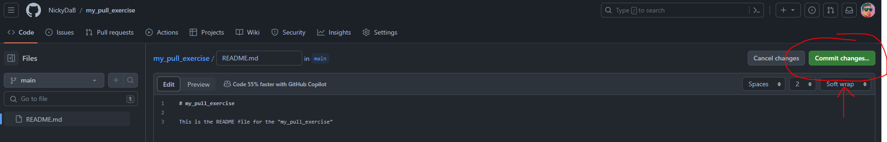
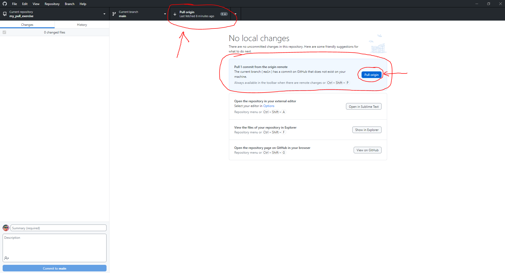
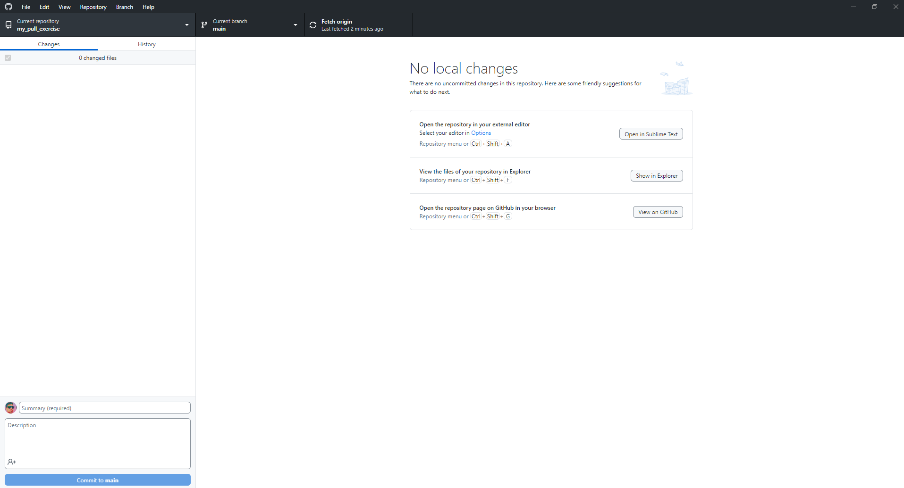
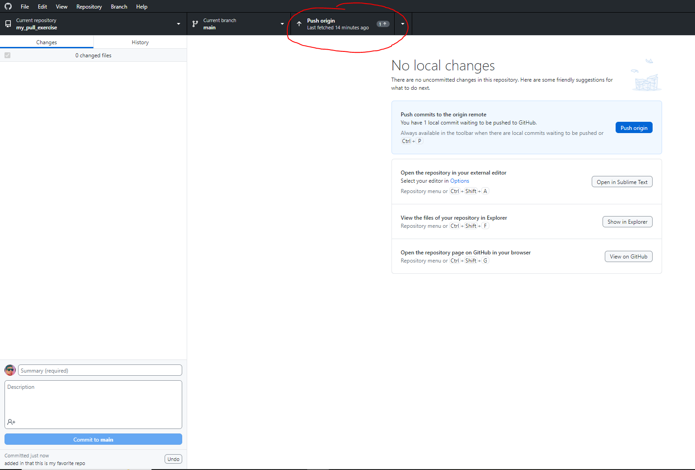

# Participation: My Pull Exercise

## Goal
Practice another component of version control, the git pull. 

## Instructions

### Setting Up

Before we get to the important parts of the exercise that we want to practice. We need to set up our environment. 

Go to your GitHub profile and make a new repo. Name it "my_pull_exercise". Make it public. Add a README file. Leave gitignore and license as none. 

This shouldn't be new, since we did that in the last exercise, but if you have issues, then raise your hand and ask Nick for help. 


Clone the repo down to your local machine using GitHub Desktop. When you have done this your local folder, GitHub Desktop, and github.com should look similar to these states:

local folder:


GitHub Desktop:


github.com:


### Pulling

Ok, now we are set up. Time to work. 

Usually on projects, we need to grab work that has been updated and pushed to the repository *(In our class - github.com)* This is usually because other people have done work and shared it with the team. We haven't gotten to that point yet, but we will eventually. Today we will simulate some of that, but practice "pulling down" so when that day comes, we are ready. 

Let's go back to github.com - We are going to edit the README file in the browser. We will do this to simulate someone else editing files and changing them. This will cause our local files to be "behind" and "out of date". This way we can practice "pulling" and getting the most recent state from the repo.

Go to the root page of the "my_pull_exercise" repo and click on the README file. 


Then click on the pencil icon on the right side of the screen. This will let us edit this file in the browser. *(Normally we won't do this, but it's helpful for this demo to simulate someone else editing files.)*


Go to line 3 and add the following:

```
This is the README file for the "my_pull_exercise"
```

Then, commit your changes to the file.



The default message of "Update README.md" should be fine.


We should see our changes reflected in the file.


Let's go back to GitHub Desktop. 


Right now, GitHub desktop and our local machine doesn't know that github.com has a new and updated state of the project. We need to tell it to "fetch" and see if there are any updates. If there are updates, then we need to pull the changes down. This way our files will be updated and we can have the most recent and up to date files. 

Go and hit the "fetch" button.


We now see GitHub Desktop update.


There is a "1" next to the "pull origin" button. 

And if we read the text in the center of the screen it says: 

> **Pull 1 commit from the origin remote**
>
> The current branch (main) has a commit on GitHub that does not exist on your machine.

This makes sense. One edit was made and we don't have that edit yet on our local machine. We can even open up our local README file to verify this state. 


Yep. Looks like our local file is behind. It doesn't have the edit we made online yet. Let's go and fix that.

Go back to GitHub Desktop.

To "pull" down and get the changes, we can press either the pull button at the top or the blue pull button in the center of the screen. Do that now.



GitHub Desktop and our local files should now be updated with the changes we pulled down from github.com - Let's check to see if that is true.




Well, looks like it updated to me. My local README file has the changes and is now in sync with the repo on github.com

Let's go back to github.com

Let's edit the README file again. Go to line 5. Add in a "by line".

Here is an example of mine:

```
My name is Nick Buonarota and this is my cool project! :) 
```

Commit this change. Don't forget to practice good notes! I left my note to say `added a "by line"`.


OOPS! I forgot to say that I'm making this for class. Let's go back and edit again.

On line 6, add in that this project is for our Intro to Programming Class.

Commit this change. Again, don't forget to practice good notes! I'll make my note say something like, "added the class to the README file".

Let's go back to GitHub Desktop. Again, it doesn't know we have made any changes. So we need to fetch. 


Looks like we have changes to pull!


It says we need to pull 2 commits if we want to catch up and be in sync with github.com - This makes sense! Since we did make 2 separate commits. 

I did this because I wanted to show you that it doesn't matter how far behind we are. When we fetch, we can see all the commits that were made since the last time we checked in with github.com - and when we pull we can pull them all down and get back in sync! 

Let's pull and get in sync one more time! Yay!

Let's double check everything. Make sure everything looks right. 


Seems right to me! 

### Pushing and Pulling

Ok, so we have pushed and we have pulled. What happens if we need to do both? What happens if we have work we have done locally and we want to push it up to github.com but github.com has some stuff that we dont have yet? 

Let's set up this scenario, then test it out.

Let's go back to github.com and edit README file one more time. 

Go to line 8 and add in the following text:

```
This is my favorite practice exercise so far!
```

Commit the file.

Now go back to the local copy of the README. Open it up in your editor of choice. I'll use notepad. 

Now, it should not have the updates yet from github.com because we haven't fetched or pulled yet. 


Go to line 3. Edit line 3 to say the following:

```
This is the README file for the "my_pull_exercise", which is my favorite repo ever!
```

Save the file.


Now let's go to GitHub Desktop. 


It knows the local file has changed. Let's commit the update. I'll make my commit message say, "added in that this is my favorite repo".


Now GitHub Desktop says we have a local change that hasn't been backed up to github.com yet, which is true. 



Let's go and hit "push" to see what happens.

We get a notification! What does it say!?


Looks like it wants us to perform a fetch first. Let's do that.

Hit the fetch button.

Thankfully we don't have any conflicts *(I set up this exercise so we wouldn't - We will deal with those in a future exercise.)*

But now we are both 1 commit ahead and 1 commit behind the state of github.com - We need to resolve this. 


So let's go and hit the pull button. 

We have now pulled down the changes. Again, thankfully we didn't have to resolve any conflicts. 

And if you check your local file, it has the updates.


But if you check github.com - it doesn't have our local changes yet. Because we still haven't pushed them up. 


Let's go push them up, so that everything is finally back in sync.


Go and push the "push" button. Then, check to see if everything looks right. 


Awesome, everything looks great!

We did this part to show that if you ever have a scenario where github.com has changes and you also have local changes, then you need to pull down the changes on github.com first before you can push up your local changes. 

This is important because you may have to resolve conflicts. We will deal with that in the future. 

But congrats on making it this far! 

## Conclusion

At this point, we are getting closer to the full power of version control, git, and github. We can now commit local changes, push those changes to github.com and pull any potential changes down from github.com - all these skills will be useful when we are working on bigger programming projects like games and other interactive media!

Congratulations! On completing the next step. You should be proud.

## Submitting

Don't forget to submit to the mycourses dropbox. See the assignment for submission guidelines.